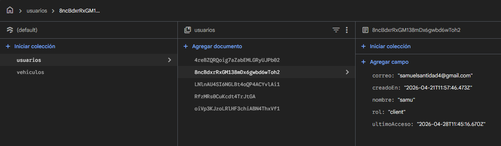
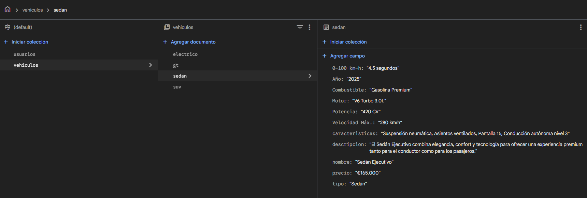
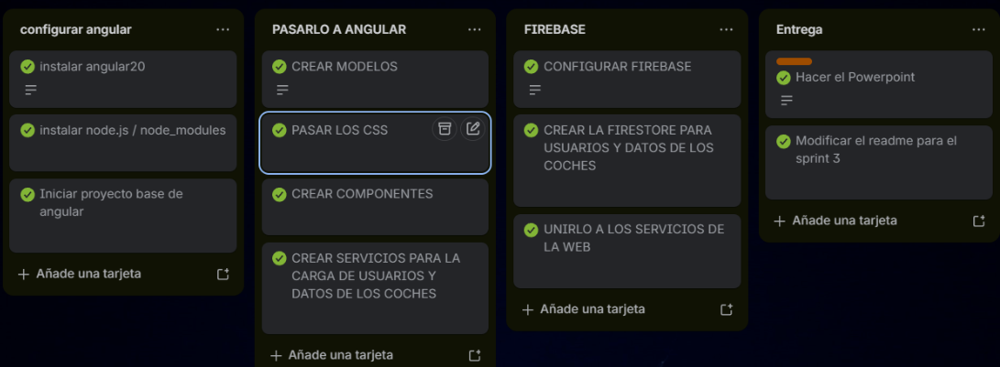

# LuxeDriveWeb


LuxeDriveWeb3 es una plataforma web moderna desarrollada con **Angular** para la gestión, visualización y adquisición de vehículos de lujo. El proyecto ofrece una experiencia de usuario premium con un flujo de compra completo, autenticación de usuarios y una interfaz responsiva, con carga de datos dinámica desde la firestore.

## 🚀 Características Principales

- **Catálogo de Vehículos:** Visualización detallada de una flota exclusiva con datos cargados dinámicamente.
- **Flujo de Checkout Seguro:** Proceso de compra en dos pasos (Información y Pago) protegido por guardias de navegación.
- **Autenticación de Usuarios:** Sistema de registro e inicio de sesión con persistencia de datos.
- **Gestión de Contenido Dinámico con Firebase:** Uso de servicios para manejar los usuarios y datos de vehículos mediante la firestore.
- **Diseño Premium:** Interfaz elegante y minimalista enfocada en la experiencia del usuario de lujo.

## 🛠️ Tecnologías Utilizadas

- **Core:** [Angular 20](https://angular.dev/)
- **Lenguaje:** TypeScript
- **Estilos:** CSS3 (BEM & Modularizado)
- **Base de Datos:** Firebase 
- **Gestión de Estado:** Firestore y Servicios de Angular


## 📂 Estructura del Proyecto

```text
src/
├── app/
│   ├── components/       # Componentes reutilizables (Header, Footer)
│   ├── guards/           # Protecciones de rutas (AuthGuard)
│   ├── models/           # Definición de interfaces y tipos
│   ├── pages/            # Componentes de página (Home, Login, Detail, etc.)
│   ├── services/         # Lógica de negocio y llamadas a datos de la firestore
│   └── firebase.config.ts # Configuración de servicios de Firebase
├── assets/
│   ├── data/             # Archivos JSON 
│   └── images/           # Recursos visuales del sitio
└── styles/               # Hojas de estilo globales y específicas
```

## 🏁 Instalación y Uso

Sigue estos pasos para ejecutar el proyecto localmente:

1. **Clonar el repositorio:**
   ```bash
   git clone <url-del-repositorio>
   cd LuxeDriveWeb
   ```

2. **Instalar dependencias:**
   ```bash
   npm install
   ```

3. **Iniciar el servidor:**
   ```bash
   ng serve
   ```
   La aplicación estará disponible en `http://localhost:4200/`.

## 🛤️ Rutas de la Aplicación

| Ruta | Descripción |
|------|-------------|
| `/` | Página de inicio con catálogo y contacto. |
| `/login` | Acceso para usuarios registrados. |
| `/register` | Formulario de creación de cuenta. |
| `/vehiculos/:id` | Detalle técnico y visual de un vehículo específico. |
| `/checkout/info` | Paso 1: Información de facturación (Protegida). |
| `/checkout/pago` | Paso 2: Pasarela de pago simulada (Protegida). |

## 🏗️ Estructura del Código

El proyecto sigue una arquitectura modular basada en componentes y servicios de Angular:

### Componentes Core
- **HeaderComponent**: Gestiona la navegación principal, el logotipo y los estados de autenticación del usuario.
- **FooterComponent**: Proporciona información de contacto, enlaces legales y redes sociales.

### Páginas (Pages)
- **HomeComponent**: Punto de entrada que muestra el catálogo dinámico de vehículos y la propuesta de valor.
- **VehicleDetailComponent**: Vista detallada que presenta especificaciones técnicas, imágenes y características de un coche específico.
- **Login/RegisterComponent**: Interfaces para la gestión de acceso y creación de cuentas de usuario.
- **CheckoutInfoComponent**: Primer paso del proceso de compra donde se recolectan datos de facturación.
- **CheckoutPaymentComponent**: Segundo paso que simula una pasarela de pago segura.

### Servicios (Services)
- **VehicleService**: Centraliza la recuperación de datos desde Firestore, aplicando normalización de datos para asegurar consistencia.
- **AuthService**: Gestiona el ciclo de vida de la autenticación con Firebase Auth y la persistencia de perfiles en Firestore.
- **SelectionService**: Mantiene el estado del vehículo seleccionado durante el flujo de compra.

---

## 🗄️ Estructura de Datos en Firebase

Los datos se organizan en dos colecciones principales en Cloud Firestore:

### 1. Colección `usuarios`
Almacena la información de perfil de cada usuario registrado:
- **Campos**:
  - `nombre`: Nombre completo del usuario.
  - `correo`: Dirección de email.
  - `rol`: Nivel de acceso (`admin` | `client`).
  - `creadoEn`: Fecha de registro (ISO string).
  - `ultimoAcceso`: Fecha del último inicio de sesión.

### 2. Colección `vehiculos`
Contiene la flota disponible para visualización y compra:
- **Campos**:
  - `nombre`: Marca y modelo.
  - `precio`: Coste base del vehículo.
  - `tipo`: Categoría (SUV, Sedán, Eléctrico, etc.).
  - `potencia`: Potencia del vehículo.
  - `descripcion`: Texto descriptivo.
  - `specs`: Array de objetos `{titulo, valor}` para datos técnicos.
  - `caracteristicas`: Lista de strings con extras destacados.

---
## 🧪 Firebase (Capturas)

Desde la firestore de firebase se hace la carga de datos dinámica de la web:

USUARIOS



DATOS VEHÍCULOS



---
## 🧭 Tour por la Web

1. **Catálogo**: Al entrar, el usuario visualiza una lista de coches cargados en tiempo real desde Firebase.
2. **Detalle**: Al hacer clic en un coche, se accede a su ficha técnica completa con especificaciones detalladas.
3. **Registro/Login**: El usuario puede crear una cuenta. Al registrarse, los datos se guardan instantáneamente en la colección `usuarios` de Firestore.
4. **Flujo de Compra**: Una vez autenticado, el usuario puede seleccionar un vehículo, rellenar su información de contacto en un formulario validado y proceder a la simulación de pago.

**Ejemplo de introducción y visualización de datos:**
- **Paso 1**: Un nuevo usuario rellena el formulario en `/register`.
- **Paso 2**: Tras el éxito, `AuthService` guarda los datos en Firestore.
- **Paso 3**: El usuario es redirigido al catálogo, y su nombre aparece en el Header, confirmando que la sesión y sus datos están activos en la plataforma.

---


## 📈 Evolución y Trello


---


