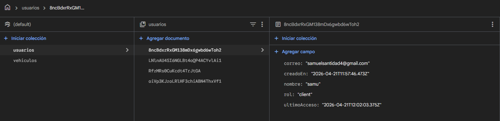
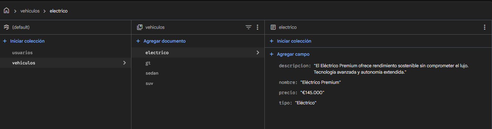

# LuxeDriveWeb3 🏎️💨

LuxeDriveWeb3 es una plataforma web moderna desarrollada con **Angular** para la gestión, visualización y adquisición de vehículos de lujo. El proyecto ofrece una experiencia de usuario premium con un flujo de compra completo, autenticación de usuarios y una interfaz responsiva, con carga de datos dinámica desde la firestore.

## 🚀 Características Principales

- **Catálogo de Vehículos:** Visualización detallada de una flota exclusiva con datos cargados dinámicamente.
- **Flujo de Checkout Seguro:** Proceso de compra en dos pasos (Información y Pago) protegido por guardias de navegación.
- **Autenticación de Usuarios:** Sistema de registro e inicio de sesión con persistencia de datos.
- **Gestión de Contenido Dinámico con Firebase:** Uso de servicios para manejar los usuarios y datos de vehículos mediante la firestore.
- **Diseño Premium:** Interfaz elegante y minimalista enfocada en la experiencia del usuario de lujo.

## 🛠️ Tecnologías Utilizadas

- **Core:** [Angular 20](https://angular.dev/)
- **Lenguaje:** TypeScript
- **Estilos:** CSS3 (BEM & Modularizado)
- **Base de Datos:** Firebase 
- **Gestión de Estado:** Firestore y Servicios de Angular


## 📂 Estructura del Proyecto

```text
src/
├── app/
│   ├── components/       # Componentes reutilizables (Header, Footer)
│   ├── guards/           # Protecciones de rutas (AuthGuard)
│   ├── models/           # Definición de interfaces y tipos
│   ├── pages/            # Componentes de página (Home, Login, Detail, etc.)
│   ├── services/         # Lógica de negocio y llamadas a datos de la firestore
│   └── firebase.config.ts # Configuración de servicios de Firebase
├── assets/
│   ├── data/             # Archivos JSON 
│   └── images/           # Recursos visuales del sitio
└── styles/               # Hojas de estilo globales y específicas
```

## 🏁 Instalación y Uso

Sigue estos pasos para ejecutar el proyecto localmente:

1. **Clonar el repositorio:**
   ```bash
   git clone <url-del-repositorio>
   cd LuxeDriveWeb3
   ```

2. **Instalar dependencias:**
   ```bash
   npm install
   ```

3. **Iniciar el servidor:**
   ```bash
   ng serve
   ```
   La aplicación estará disponible en `http://localhost:4200/`.

## 🛤️ Rutas de la Aplicación

| Ruta | Descripción |
|------|-------------|
| `/` | Página de inicio con catálogo y contacto. |
| `/login` | Acceso para usuarios registrados. |
| `/register` | Formulario de creación de cuenta. |
| `/vehiculos/:id` | Detalle técnico y visual de un vehículo específico. |
| `/checkout/info` | Paso 1: Información de facturación (Protegida). |
| `/checkout/pago` | Paso 2: Pasarela de pago simulada (Protegida). |

## 🧪 Firebase

Desde la firestore de firebase se hace la carga de datos dinámica de la web como el contenido de los coche y la carga de usuarios para iniciar sesión/registrarse:



---
